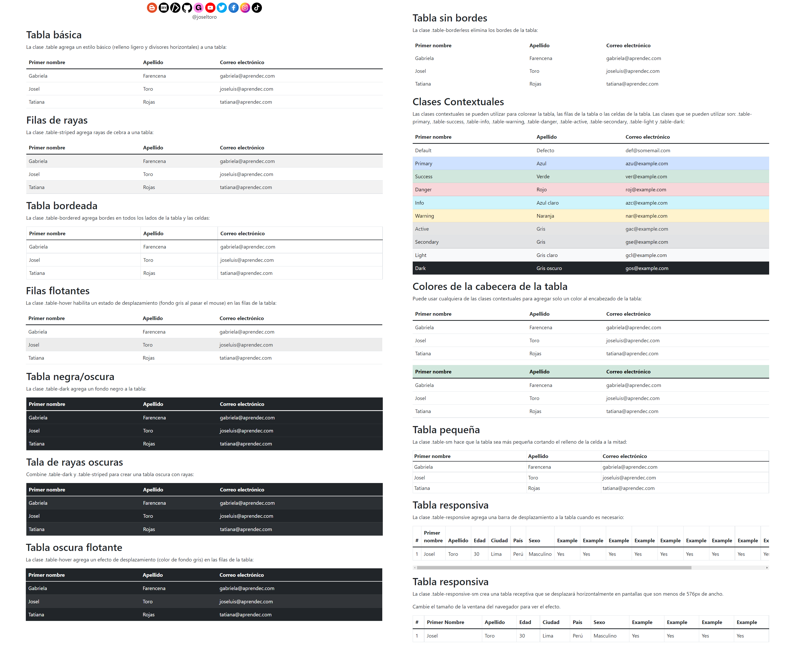

# Bootstrap 5 | Tables

📒 Tabla básica

    📝Una tabla básica en Bootstrap 5 tiene un padding ligero y divisores horizontales.

    📝La clase .table agrega un estilo básico a una tabla:

📒 Filas de rayas

    📝La clase .table-striped agrega rayas de cebra a una tabla:

📒 Tabla bordeada

    📝La clase .table-bordered agrega bordes en todos los lados de la tabla y las celdas:

📒 Filas flotantes

    📝La clase .table-hover agrega un efecto de desplazamiento (color de fondo gris) en las filas de la tabla:

📒 Tabla negra/oscura

    📝La clase .table-dark agrega un fondo negro a la tabla:  

📒 Tabla de rayas oscuras

    📝Combine .table-dark y .table-striped para crear una mesa oscura con rayas:   

📒 Tabla oscura flotante

    📝La clase .table-hover agrega un efecto de desplazamiento (color de fondo gris) en las filas de la tabla:

📒 Tabla sin bordes

    📝La clase .table-borderless elimina los bordes de la tabla:

📒 Clases Contextuales

    📝Las clases contextuales se pueden usar para colorear toda la tabla (<table>), las filas de la tabla (<tr>) o las celdas de la tabla (<td>).

    📝Las clases contextuales que se pueden utilizar son:
    
        🔸.table-primary   | Azul: indica una acción importante
        🔸.table-success   | Verde: Indica una acción exitosa o positiva
        🔸.table-danger    | Rojo: indica una acción peligrosa o potencialmente negativa
        🔸.table-info      | Azul claro: Indica un cambio o acción informativa neutra
        🔸.table-warning   | Naranja: indica una advertencia que podría necesitar atención
        🔸.table-active    | Gris: aplica el color flotante a la fila o celda de la tabla
        🔸.table-secondary | Gris: indica una acción un poco menos importante
        🔸.table-light     | Fondo gris claro de la tabla o de la fila de la tabla
        🔸.table-dark      | Fondo gris oscuro de la tabla o de la fila de la tabla

📒 Colores de la cabecera de la tabla

    📝También puede usar cualquiera de las clases contextuales para agregar solo un color de fondo al encabezado de la tabla:

📒 Mesa pequeña

    📝La clase .table-sm hace que la tabla sea más pequeña cortando el relleno de la celda a la mitad:

📒 Tablas responsivas

    📝La clase .table-responsive agrega una barra de desplazamiento a la tabla cuando es necesario (cuando es demasiado grande horizontalmente):

    

        <table class="table">
            ...
        </table>
    

    📝También puede decidir cuándo la tabla debe tener una barra de desplazamiento, según el ancho de la pantalla:

    Class	                        Screen width
    .table-responsive-sm	<       576px
    .table-responsive-md	<       768px
    .table-responsive-lg	<       992px
    .table-responsive-xl	<       1200px
    .table-responsive-xxl	<       1400px

    

        <table class="table">
            ...
        </table>
    

Redes sociales:

- https://instagram.com/dev.joseltoro
- https://facebook.com/devjoseltoro
- https://tiktok.com/@dev.joseltoro
- https://dev.to/joseltoro
- https://code.dcoder.tech/profile/joseltoro
- https://joseltoro.blogspot.com/
- https://joseltoro.gumroad.com/